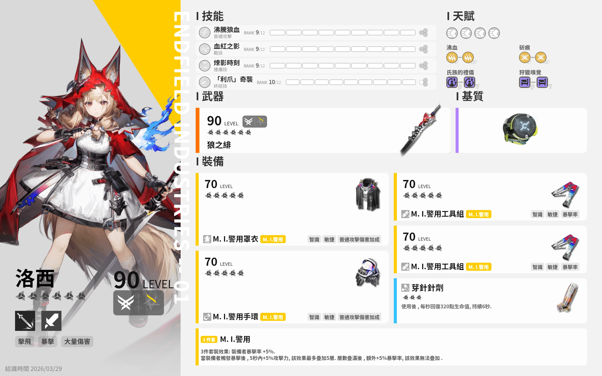
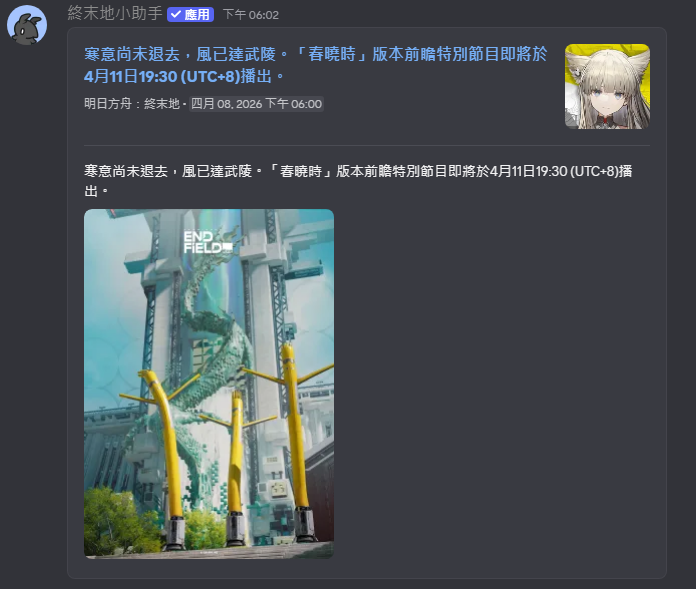
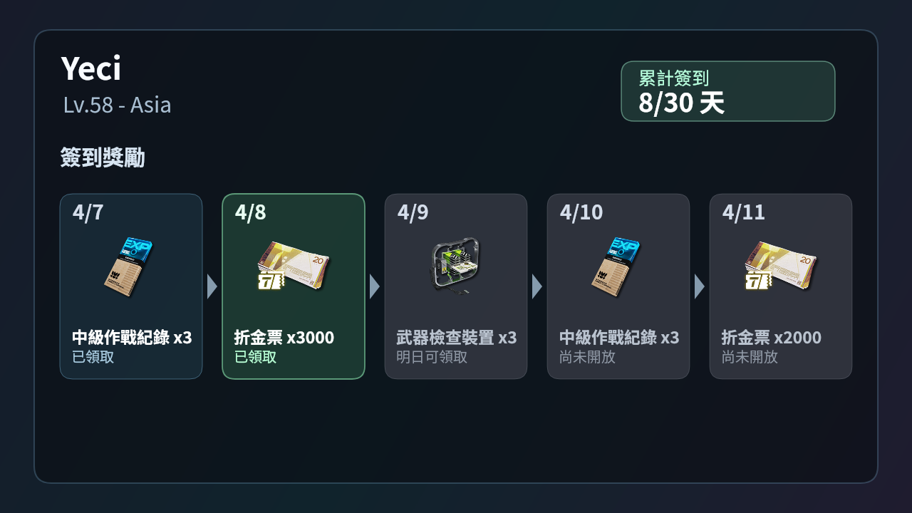
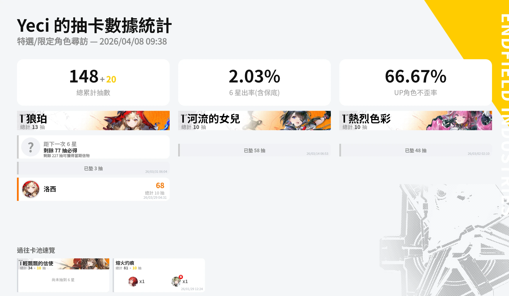
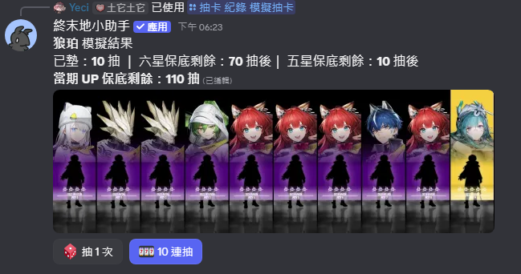

<div align="center">

<!-- Replace with your banner image -->


<br />
<br />

# Endfield Discord Bot

**An Arknights: Endfield companion bot for Discord**

[](https://discord.js.org)
[](https://nodejs.org)
[](https://www.typescriptlang.org)
[](LICENSE)

<br />

**English** | [繁體中文](README_ZH.md)

<br />

<!-- Replace with a real screenshot or GIF of your bot in action -->


</div>

---

## Features

| Feature             | Description                                         |
| ------------------- | --------------------------------------------------- |
| **Gacha Simulator** | Simulate pulls with accurate Endfield banner rates  |
| **Gacha Records**   | Sync and view your in-game pull history             |
| **Daily Check-in**  | Claim rewards and track attendance streaks          |
| **Player Profile**  | View your Endfield player card with rich visuals    |
| **News Feed**       | Stay updated with the latest Endfield announcements |
| **Account Binding** | Link your Endfield account for personalized data    |
| **Auto Daily**      | Automatically claim daily rewards on your behalf    |
| **Multi-language**  | Supports Traditional Chinese and English            |

---

## Getting Started

### Prerequisites

- [Node.js](https://nodejs.org) v18+
- [Yarn](https://yarnpkg.com)
- A Discord bot token

### Installation

```bash
# Clone the repository
git clone https://github.com/your-username/endfield-discord-bot.git
cd endfield-discord-bot

# Install dependencies
yarn install

# Copy and configure environment variables
cp .env.example .env
```

### Configuration

Copy `.env.example` to `.env` and fill in your values:

```env
# Discord
DISCORD_TOKEN=
TEST_DISCORD_TOKEN=

# Encryption
ENCRYPTION_KEY=

# Web Server
VERIFY_PORT=3838
VERIFY_HUB_URL=http://localhost:3000/endfield
EDITOR_PUBLIC_URL=http://localhost:3838

# Webhooks (optional)
ERRWEBHOOK=
CMDWEBHOOK=
JLWEBHOOK=
```

### Running

```bash
# Development (with hot reload)
yarn dev

# Production
yarn start
```

---

## Commands

### General

| Command     | Description                                   |
| ----------- | --------------------------------------------- |
| `/gacha`    | Open the gacha simulator or view pull records |
| `/daily`    | Claim your daily check-in reward              |
| `/profile`  | View your Endfield player profile             |
| `/news`     | Browse the latest Endfield news               |
| `/language` | Change your preferred language                |

### Account

| Command  | Description                |
| -------- | -------------------------- |
| `/login` | Bind your Endfield account |

### Admin

| Command            | Description                         |
| ------------------ | ----------------------------------- |
| `/movedailynotify` | Move the daily notification channel |

---

## Screenshots

<div align="center">

<!-- Replace these placeholders with actual screenshots -->


<br /><sub><b>News Feed</b></sub>

<br /><br />


<br /><sub><b>Player Profile</b></sub>

<br /><br />


<br /><sub><b>Daily Check-in</b></sub>

<br /><br />


<br /><sub><b>Gacha Records</b></sub>

</div>


<br /><sub><b>Gacha Simulator</b></sub>

<br /><br />

---

## Tech Stack

- **[Discord.js v14](https://discord.js.org)** — Discord API framework
- **[TypeScript](https://www.typescriptlang.org)** — Type-safe JavaScript
- **[@napi-rs/canvas](https://github.com/Brooooooklyn/canvas)** — High-performance canvas for image generation
- **[Better SQLite3](https://github.com/WiseLibs/better-sqlite3)** — Local database
- **[Express](https://expressjs.com)** — Internal web server for OAuth verification
- **[discord-hybrid-sharding](https://github.com/meister03/discord-hybrid-sharding)** — Sharding support

---

## Contributing

Contributions are welcome! Feel free to open an issue or submit a pull request.

---

<div align="center">

Made with dedication for the Arknights: Endfield community

</div>
